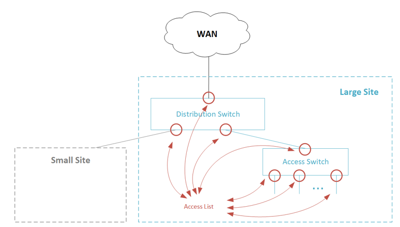

Access Control Lists (ACL) enable you to apply policies on traffic flows by setting matching criteria (for example, 5-tuple) and actions (for example, pass/drop). The ACL can be used to restrict traffic forwarding, limit traffic rate, maintain statistics and trigger network address translation. ACL rules can be added/removed at any time and can apply to traffic ingresses and/or egresses, at the port level. 

## Linux Support
Linux Traffic Control (TC) flower filter enables configurating queueing disciplines (qdiscs) and chains. To ease configuration and avoid duplication, use shared blocks to bind multiple ports to the same list of rules.  To maintain flexibility in rule creation, and ensure efficient hardware resource utilization, use chain templates, including multi-chain support (with ‘goto’ action).

### Linux Commands

