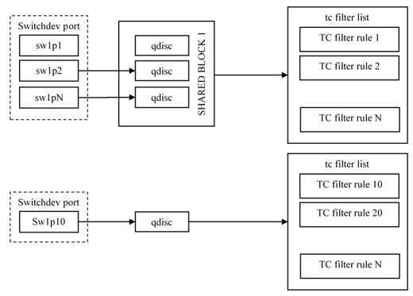

This section includes the following:
* [ACL Overview](#acl-overview)
* [Linux Support](#linux-support)
* [ACL Configuration](#acl-configuration)
* [Supported Actions, Keys and Rules](#supported-actions-keys-and-rules)

## ACL Overview 
Access Control Lists (ACL) enable you to apply policies on traffic flows by setting matching criteria (for example, 5-tuple) and actions (for example, pass/drop). The ACL can be used to restrict traffic forwarding, limit traffic rate, maintain statistics and trigger network address translation. ACL rules can be added/removed at any time and can apply to traffic ingresses and/or egresses, at the port level. 

## Linux Support
Linux Traffic Control (TC) flower filter enables configuring queuing disciplines (qdiscs) and chains. To ease configuration and avoid duplication, use shared blocks to bind multiple ports to the same list of rules.  To maintain flexibility in rule creation, and ensure efficient hardware resource utilization, use chain templates, including multi-chain support (with ‘goto’ action).

The following figure shows TC queueing disciplines (qdiscs) and filter rules.

## ACL Configuration
To offload Linux ACL configuration to netdevs, which represent Marvell switch ports, you can use one of the following:
* TC flower filter [6] tool 
* Netfilter [7], for Linux kernel v5.3 and higher, since it uses a common kernel API to do ACL offload configuration.  

### Create/Add ACL Rules  
Before configuring match rules on switch ports, you must first create the queuing disciplines (qdiscs) to which the flower classifier is attached. In order to prepare for the addition of flower rules, either add the `ingress` qdisc, or `clsact` qdisc to the port, using the following TC command:  
`$ sudo tc qdisc add dev DEV-NAME {ingress|clsact}`  
Where `DEV-NAME` is the switchDev interface name, e.g.: sw1p1.  

* To create ingress queuing disciplines (qdiscs):  
`$ sudo tc qdisc add dev sw1p1 ingress`  
* To create the clsact qdisc:  
`$ sudo tc qdisc add dev sw1p10 clsact`  
**NOTE**: there are no functional differences between these two types
* To list the existing qdiscs:  
`$ tc qdisc show`  

Output example of the show command:  
`qdisc ingress ffff: dev sw1p1 parent ffff:fff1 -------------`  
`qdisc clsact ffff: dev sw1p10 parent ffff:fff1` 

The rest of the examples in this document uses clsact qdisc and generic commands for ACL rule configuration.  
ACL rule configuration uses the following format:  
`tc [ OPTIONS ] qdisc [ add|show|delete ] dev DEV [ ingress|root ] [ handle qdisc-id ] [ protocol PROTO ] [ { prio|pref } PRIORITY ] flower [ flower specific parameters ]`  
Where:  
    `ingress`  is used for clsact qdisc.  
    `root`  is used for ingress qdisc.   
For more information on flower specific parameters, see the man tc-flower page.  
**NOTE**: The driver does not support all parameters. See 
[Supported Actions, Keys and Rules](#supported-actions-keys-and-rules)
 for the full list of supported actions and keys.   

### Add Flower (ACL) Rules  
Once the qdisc is created, you can add flower rules which are bound to a specific qdisc/switchdev interface.   
For example, to create a flower rule which drops an IP packet with source address 192.168.1.1, use the following command:  

`$ sudo tc filter add dev sw1p1 ingress protocol ip pref 10 flower skip_swrc_ip 192.168.1.1 action drop`  
 
This adds a rule with priority (`pref`) 10, matching and dropping every IP packet with the source address 192.168.1.1.  

**NOTE**: the parameter `skip_sw` instructs the TC to skip the insertion of the rule to the kernel's datapath. If this keyword is omitted, the rule is inserted in both the kernel and hardware.  

To add the rule to kernel, e.g. filter CPU traffic, use the `skip_hw` key instead.  

TC rules (filters) are put by order of priority (`pref`). If the priority is omitted, the TC will generate priority automatically based on flower rule/actions provided by user. For rules with the same priority, but different match/action value, the rule is added to the end of all rules with this priority. The rule with lowest `pref` number (high priority) is executed first.  

Similar commands can be used to pass the packet or trap the packet to CPU. For example:  
* To add a pass rule with a different source IP address:  
`$ sudo tc filter add dev sw1p1 ingress protocol ip pref 20 flower skip_sw src_ip 192.168.1.2 action pass`  
* To trap to a CPU rule:  
`$ sudo tc filter add dev sw1p1 ingress protocol ip pref 30 flower skip_sw src_ip 192.168.1.3 action trap`  
* To show qdiscs filter rules  
`$ tc filter show dev sw1p1 ingress`  
* To observe statistics related to packets, bytes transmitted, or last time used, which are maintained on a per rule basis, add the -s flag:  
`$ tc -s filter show dev sw1p1 ingress`  

See [Supported Actions, Keys and Rules](#supported-actions-keys-and-rules) for the full list of supported rules. Following are several examples showing how to use TC with other supported ACL keys (tc flower match):   
`$ sudo tc filter add dev sw1p1 ingress pref 25 protocol 0x8FF flower skip_sw action pass`  
`$ sudo tc filter add dev sw1p1 ingress prio 24 flower skip_sw src_mac 00:11:22:33:44:88 action drop`  
`$ sudo tc filter add dev sw1p1 ingress protocol ip flower skip_sw ip_proto tcp action drop`  
`$ sudo tc filter add dev sw1p1 ingress preference 43 protocol ip flower skip_sw ip_proto tcp src_port 39 action trap`  
`$ sudo tc filter add dev sw1p1 ingress protocol all flower skip_sw action drop`  

**NOTE**: some TC command keys support different naming (alias) for some attributes. For example, `pref` Key can be used as `prio`.

### Delete ACL Rules
A TC flower rule (ACL rule) is deleted based on delete criteria provided by user.  
For example, to delete all rules with a given priority, use the following command:  
`$ tc filter del dev sw1p1 root prio 1`  

If there are multiple rules in qdisc with the same priority, then the specific rule can be deleted by handle qdisc-id.  
For example, to delete the rule with priority 1 and handle 0x2:  
`$ sudo tc filter del dev sw1p1 root prio 1 handle 0x2 flower`  

**NOTE**: Use `tc filter show dev sw1p1 root` command to determine which handle to use.  

To delete all rules from a specific qdisk, use the following command:  
`$ sudo tc filter del dev sw1p1 root`  

If an ACL is not going to be used anymore on the switchdev interface, use the following command to destroy the qdisc with all rules attached to it:
`$ sudo tc qdisc del dev sw1p1 parent ffff:`  

## Supported Actions, Keys and Rules

### ACL supported actions [3]
* drop
* trap
* pass
### ACL supported keys [3]
* Ingress interfaces (only switchdev interface)
* Protocol (ethertype)
* src_mac
* dst_mac
* src_ip (IPv4)
* dst_ip (IPv4)
* ip_proto (Tcp/Udp)
* src_port
* dst_port
* vlan_id
### Supported TC Flower Rules and Actions
The following list of ACL rules (TC flower matches) are supported:
* indev DEV-NAME (useful when using qdisc blocks, which is described in next major section)
* protocol PROTO (tc filter option, not flower filter type)
* dst_mac MASKED-LLADDR
* src_mac MASKED-LLADDR
* ip_proto [tcp | udp] (protocol ip)
* dst_ip PREFIX (protocol ip)
* src_ip PREFIX (protocol ip)
* dst_port {NUMBER | MIN_VALUE-MAX_VALUE} (ip_proto tcp|udp)
* src_port {NUMBER | MIN_VALUE-MAX_VALUE} (ip_proto tcp|udp)
* vlan_id
The following ACL actions (TC flower actions) are supported:
* drop (shot word also can be used to specify drop action)
* pass (ok word also can be used to specify pass action)
* trap

