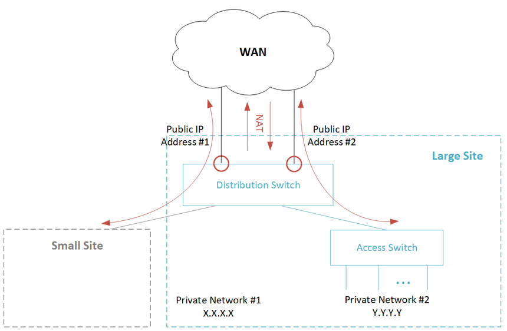

Network Address Translation (NAT) enables translation of a packet’s private network address to a public network address. Typically NAT is applied at the uplink interfaces that connect to WAN.
NAT covers both IPv4 and IPv6 networks:
* NAT44 - IPv4-to-IPv4 Network Address Translation
* NAT66 - IPv6-to-IPv6 Network Address Translation
* NAT-PT - IPv4-to-IPv6 Network Address Translation

The following figure shows network address translation between a large site, and a WAN.

