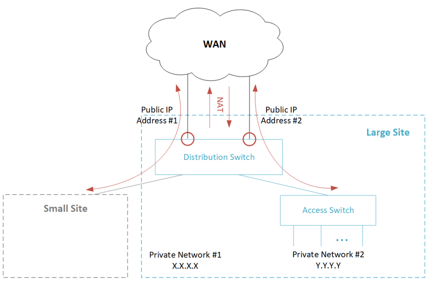
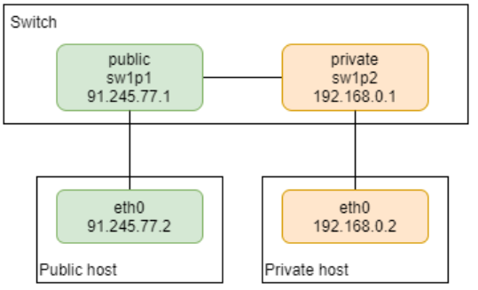
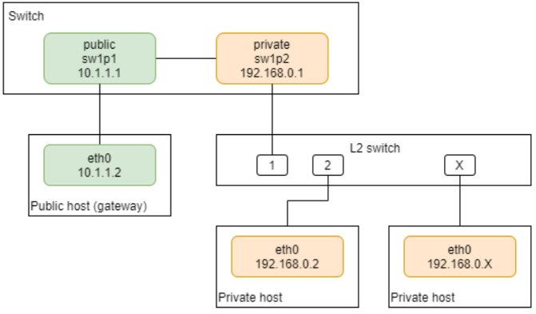

Network Address Translation (NAT) enables translation of a packet’s private network address to a public network address. Typically NAT is applied at the uplink interfaces that connect to WAN.
NAT covers both IPv4 and IPv6 networks:
* NAT44 - IPv4-to-IPv4 Network Address Translation
* NAT66 - IPv6-to-IPv6 Network Address Translation
* NAT-PT - IPv4-to-IPv6 Network Address Translation

This section explains the following NAT configuration types:
* [Static (Stateless) NAT Configuration](Static-(Stateless)-NAT-Configuration)
* [Dybanuc (Stateful) NAT Configuration](Dybamic-(Stateful)-NAT-Configuration)

The following figure shows network address translation between a large site, and a WAN.



## Static (Stateless) NAT Configuration

To configure stateless Network Address Translation (NAT), use the `tc` iproute2 tool, with the `tc-nat` action. The action is used in combination with the `flower` filter rule and ingress qdisc to do static NAT entry offloading.
This is the command format: 
```
tc … flower ... action nat { ingress | egress } <OLD> <NEW> 
```
where, 
* `<OLD>`   is the IP address which should be translated. 
* `<NEW>`         is the IP address which IP should be translated into. 
* `ingress`         translate destination addresses, i.e. perform DNAT. 
* `egress`         translate source addresses, i.e. perform SNAT. 

To implement NAT one-to-one mapping, you must configure one rule for private-to-public direction, and another rule for public-to-private direction. For more information on `tc-nat` action, see the official man page at [[https://man7.org/linux/man-pages/man8/tc-nat.8.html]]. 

## Basic Example 
Create a static one-to-one mapping from a private (sw1p2) to a public (sw1p1) subnet for all TCP traffic.  The IP 192.168.0.0/24 is the private subnet. 
The following figure shows static NAT setup: 



First, you must define IP addresses on the public/private host interfaces connected to the switch: 
```
# private host IP / default gateway 
ip addr add dev eth0 192.168.0.2/24 
ip route add default via 192.168.0.1 

# public host IP address (WAN port) 
ip addr add dev eth0 10.1.1.2/24 
```
Next, configure IP addresses on the public/private switch ports: 

```
ip addr add dev sw1p2 192.168.0.1/24 
ip addr add dev sw1p1 91.245.77.1/24 
```
Add a default gateway on the switch, to route packets via a public interface. 

```
# add default gateway via public interface 
ip route add default via 91.245.77.1 
```
Configure ACL rules on the switch to do NAT offloading: 

```
# public ports  
tc qdisc add dev sw1p1 clsact 
tc filter add dev sw1p1 protocol ip egress \ 
   flower ip_proto tcp src_ip 192.168.0.2 \ 
   action nat egress 192.168.0.2 91.245.77.1 

tc filter add dev sw1p1 protocol ip ingress \ 
   flower ip_proto tcp dst_ip 91.245.77.1 \ 
   action nat ingress 91.245.77.1 192.168.0.2 

# private ports, create only HW rule 
tc qdisc add dev sw1p2 clsact 
tc filter add dev sw1p2 protocol ip ingress \ 
   flower skip_sw ip_proto tcp src_ip 192.168.0.2 \ 
   action nat egress 192.168.0.2 91.245.77.1 
```
NOTE: The configuration is slightly different from the usual Linux software configuration of stateless TC NAT, where NAT rules are applied on a public port only (such as, WAN port). For instance: 
```
# public network 
tc qdisc add dev eth0 ingress 
tc filter add dev eth0 ingress protocol ip matchall \ 
   action nat ingress 172.31.19.2/32 10.0.2.2/32 
 
# private network 
tc qdisc add dev eth0 root handle 1: prio 
tc filter add dev eth0 parent 1: protocol ip matchall \ 
   action nat egress 10.0.2.2/32 172.31.19.2/32 
```
NOTE: Egress `qdisc` (egress ACL) is not supported by the Switchdev driver. Therefore, the public/private Switchdev TC NAT configuration is done using ingress `qdisc` only, which requires adding hardware rules on the private switch port.

## Private to Private Flow
To skip NAT for packets that are destined for private subnet or hosts, you need to install additional rules on private ports. For example, a rule that matches a private subnet with a higher priority should be installed with the action “do nothing”. 

```
tc filter add dev sw1p2 protocol ip ingress \ 
   flower skip_sw ip_proto tcp dst_ip 192.168.0.1/24 action pass 
```
NOTE: The last rule added has the higher priority, so there is no need to define the priority in the rule (see [Supported Actions, Keys and Rules](supported-actions,-keys-and-rules) for more information).

# Dynamic (Stateful) NAT Configuration
The configuration of stateful NAT is done by using `tc` iproute2 tool and the `tc-ct` action. The action is used in combination with `flower` filter rule and ingress qdisc to do the dynamic NAT entry offloading. The user guide for stateful NAT is described in tc-flower and tc-ct man pages. 

NOTE: The stateful NAT feature requires Linux kernel 5.8.9 and above. 

## Basic Configuration 
This example covers the basic use case (many-to-one, with one private Switchdev port) for stateful NAT configuration, using a TC connection tracking subsystem. 

The following figure shows dynamic NAT setup: 



NOTE: This scenario also covers the case of only one private host. 
Configuration of private host connected to the switch device (in this case on one private): 
```
# private host: IP/default gateway 
ip addr add dev eth0 192.168.0.2/24 
ip route add default via 192.168.0.1 
```
Configuration of public host connected to the switch device: 

```
# public host: IP 
ip addr add dev eth0 10.1.1.2/24 
```
IP configuration on the switch: 

```
# switch: private/public interface IP 
ip addr add dev sw1p2 192.168.0.1/24 
ip addr add dev sw1p1 91.245.77.1/24 
```
Add default gateway on the switch to route packets via public interface. 
```
# add default gateway via public interface 
ip route add default via 91.245.77.1 
```
Configure connection tracking on private port: 
```
tc qdisc add dev sw1p2 clsact 
tc filter add dev sw1p2 ingress proto ip pref 2 flower ct_state -trk \ 
  action ct 
```
Configure NAT connection tracking on public port: 
```
tc qdisc add dev sw1p1 clsact 
tc filter add dev sw1p1 egress prio 10 proto ip flower \ 
  action ct commit nat src addr 91.245.77.1 pipe action pass 
tc filter add dev sw1p1 ingress prio 5 proto ip flower \ 
  action ct nat pipe action pass 
```
NOTE: Since the NAT configuration is done using regular ACL rules, it takes resources from regular ACL memory. 

NOTE: Egress CT flower filter on a public port should be the same as CT flower filter on a private port. If a CT rule exists on multiple private port, those flower matches should be reflected on the egress public port. 

### Private to Private Flow 

To skip NAT for packets that are destined for private subnet or hosts, you need to install additional hardware offloaded rules (`skip_sw` flower option) on private ports. For example, a rule that matches a private subnet with higher priority should be installed with the action “do nothing” on each of the private ports. 
```
tc filter add dev sw1p2 protocol ip ingress \ 
   flower skip_sw ip_proto tcp dst_ip 192.168.0.1/24 action pass 
```
NOTE: The last rule added has the higher priority, so there is no need to define the priority in the rule (see the ACL document for more information).  
