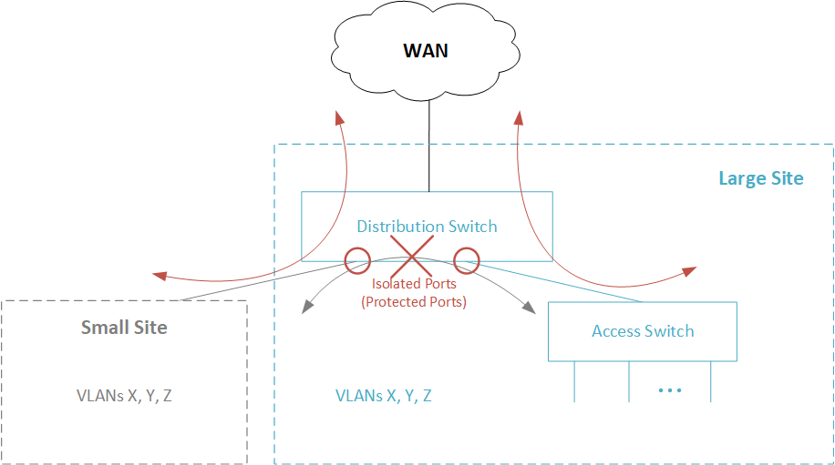

Port isolation (also called ‘protected ports’ or ‘pvlan edge’) enables you to control how traffic is forwarded between ports that are connected at the same bridge domain. Traffic between isolated ports is prevented regardless of their VLAN membership. However, isolated ports can still communicate with non-isolated ports such as uplink to access WAN. 

The following image shows how port isolation is implemented.

## Linux Support
This capability is supported by Linux kernels since 4.18. The support is provides on the port level (that is, not per port and vlan). Isolation is always applied on netdev switch ports.

Linux Command:

`bridge link set dev DEV [isolated {on|off}]`

This setting is available through (rt) netlink, and it has no equivalent in ioctl/brctl

12.2	Design Guidelines

Port Isolation utilizes a dedicated hardware mechanism in Marvell Prestera switch devices, called ‘Port Isolation – Protected Ports’. This mechanism enables/disables traffic forwarding between any pair of ingress port and egress port in a single-device topology and back-to-back topology. 

Traffic should be matted based on the source ePort that represents the source physical port.

### SwitchDev Driver

High-level requirements:
* New bridge port attribute of type ‘isolated’
* Ability to enable/disable port isolation on bridge physical port member

CPSS APIs for reference:
* cpssDxChBrgSrcIdPortDefaultSrcIdSet
* cpssDxChBrgSrcIdGroupPortAdd
* cpssDxChBrgSrcIdGroupPortDelete

