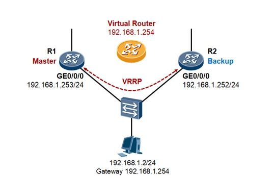

# Introduction: Linux MAC VLAN Interface  
The MAC VLAN can be thought of as a reverse VLAN under Linux. Instead of taking a single interface on the OS side of a network interface and mapping it to multiple virtual networks on the Network side of the interface (one to many), a MAC VLAN takes a single Network interface and creates multiple virtual ones with different MAC addresses (many to one).

macvlan's Rx handler re-injects packets with destination MAC addresses as the MAC VLANs to the Rx path so that they are picked up by the IPvX protocol handlers, and undergo an L3 lookup. Note that the driver prevents the MAC VLANs from being enslaved to other devices, to ensure that the packets are picked up by the protocol handler and not by another Rx handler. 

* To create a MAC VLAN device:  
`$ sudo ip link add link sw1p1 type macvlan`  
`$ sudo ip link add link sw1p1 mac1 address 00:11:22:33:44:55 type macvlan`  

# Virtual Router Redundancy Protocol (VRRP)
The Virtual Router Redundancy Protocol (VRRP) is a computer networking protocol that enables automatic assignment of available Internet Protocol (IP) routers to participating hosts. This increases the availability and reliability of routing paths via automatic default gateway selections on an IP subnetwork.  
The protocol achieves this by creating virtual routers, which are an abstract representation of multiple routers, i.e. master and backup routers, acting as a group. The virtual router is assigned to act as a default gateway of participating hosts, instead of a physical router. If the physical router that is routing packets on behalf of the virtual router fails, another physical router is selected to automatically replace it. The physical router that is forwarding packets at any given time is called the master router.[7]  

## VRRP Implementation in Linux
In Linux, VRRP is usually implemented by configuring a MAC VLAN with the virtual router MAC on top of the router interface that is connected to the host / LAN. The MAC VLAN on the master router is assigned the virtual IP (VIP) that the host uses as its gateway.  
The Switchdev open source implements VRRP using the keepalived service.  

## Generic VRRP Network Topology
  
